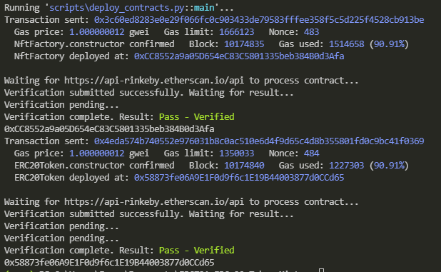
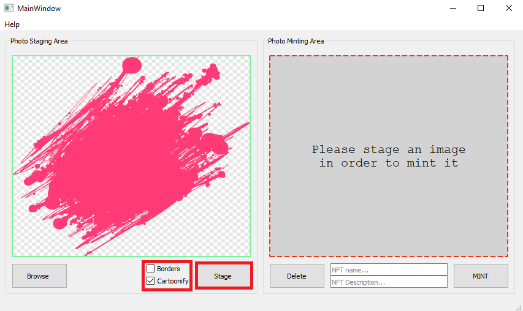

# ERC-721 + ERC-20 Token Minter Gui
This project gives users an all in one NFT creation experience, and consists of two smart contracts. The first is a NFT Factory contract that depends on OpenZeppelin's ERC-721 libraries. The second is an ERC-20 token contract that incentivizes users to mint their NFT's through the program. Users can apply basic style filters to their .PNG or .JPG, give a name and description, and then mint it onto any EVM compatible network. When a user mints an NFT, they are awarded 1 to 15 ERC-20 tokens determined randomly by a Chainlink VRF oracle.

This project is still in its infancy, so no smart contracts exist on-chain, however, both contracts are provided in the repo and can be deployed to test the GUI's functionality. Steps are provided below. 

*NOTE: This has only been tested on the Rinkeby network, but out of the box support for other networks will be added.* 

This project is a Chainlink, 2021 Fall Hackathon winner. https://devpost.com/software/erc-20-erc-721-token-minter-gui

# Project Requirements  
1) MetaMask - https://metamask.io/faqs/   
 - Obtain Rinkeby ETH and LINK - https://faucets.chain.link/rinkeby  
3) Provider (choose one from below):   
 - Infura - https://infura.io/  
 - Alchemy - https://www.alchemy.com/  
 - Moralis - https://moralis.io/speedy-nodes/   
4) Etherscan API Key - https://etherscan.io/myapikey  
5)  Pinata - https://docs.pinata.cloud/
6)  IPFS command-line - https://docs.ipfs.io/install/command-line/#official-distributions

# Setup Steps  

### 1) Clone repository  
~~~
git clone https://github.com/McManOfTheLand/ERC721-ERC-20-Token-Minter
~~~
### 2)  Create and activate python virtual enviroment  
~~~
python3 -m venv venv
./venv/scripts/activate
~~~
### 3)  Install packages  
~~~
pip install -r requirements.txt
~~~

### 4) Create .env file  
Inside the root directory of your project, create a .env file. Add API keys as well as your MetaMask accounts private key.

 
### 5) Deploy contracts  
To set the name and symbol for smart contracts, navigate to the `ERC721-ERC-20-Token-Minter/scripts/deploy_contracts.py` folder and change the deployment parameters that will ultimately get passed to the smart contract's constructor.  
Deploy contracts to the Rinkeby network:
~~~
brownie run scripts/deploy_contracty.py --network rinkeby
~~~
A successful deployment to the Rinkeby test network should look something like this:  
  
### 6) Send LINK from your wallet to your deployed ERC-20Token.sol contract. This is an imperative step. Not doing so will result in the program crashing when you try and mint an NFT.   
### 7) Start IPFS server  
In a new terminal, run the command:  
~~~
ipfs daemon
~~~
13) Once all of this set up is complete, you can finally start the gui. Run the command:
~~~
brownie run PATH/TO/start_gui.py --network rinkeby
~~~

14) Click on "browse" to select image with extension .PNG or .JPG. Once image has loaded in, select a style. 

15) Select a style, then click "stage" to add image to the minting area. If you want to unstage an image, click "delete" to remove it.

 
16) Give your NFT a name and description, then click "MINT" to start the minting process.
 
17) If you followed the above steps correctly, your console should look something like this:

A successfull transaction means: 
You can view your NFT at https://testnets.opensea.io/account (make sure you are connected to the OpenSea rinkeby testnet). 
Your wallet gains from 1 and 15 ERC-20 Tokens from the contract you previously deployed.

Blockchains can take time. If you are not seeing your NFT or tokens immedietly, check back in several mintutes.
## Congragulations. You've done it!

## Project workflow: 

