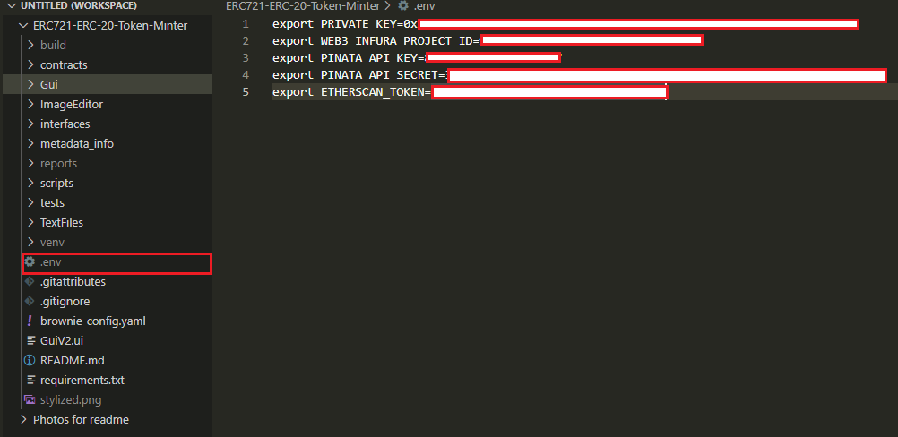
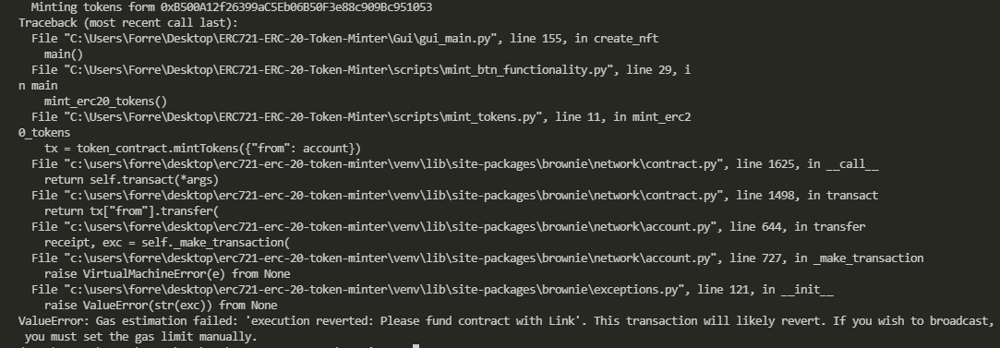
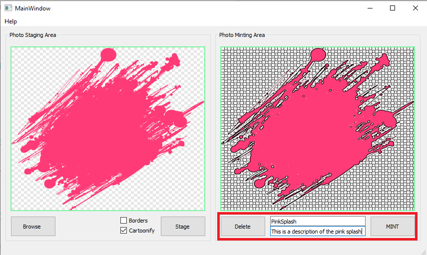

# ERC-721 + ERC-20 Token Minter Gui
This project aims to give users an all in one NFT creation experience, and is comprised of two smart contracts. The first is an NFT Factory contract that depends on OpenZeppelins ERC-721 libraries. The second contract is a basic ERC-20 token contract that incentivizes users to mint their NFT's through this program. Using the gui included as  part of this repo, users are able to select any .PNG or .JPG images from local storage, apply basic style filters, give a name and description, and mint it onto an Ethereum network. When a user mints an NFT, they will also be awarded from 1 and 15 ERC-20 tokens for minting their NFT through this projects ERC-721 contract. When an NFT created on this platform sells, a small fee will be applied. A Chainlink VRF was used to generate the randomness for deciding how many ERC-20 tokens are given to the user for minting an NFT.

This project is still in it's infancy, so no smart contracts exist on-chain, however, both contracts are provided in the repo, and can be deployed to test the gui's functionality. Steps are provided below. 

*NOTE: This has only been tested on the Rinkeby network, but out of the box support for other networks will be added.*

*This project is in it's early stages, and was made for the Chainlink, 2021 Fall Hackathon.
https://chain.link/hackathon*

# How to use
There are a handful of required setup steps for this project.
1) You will need to install and create an account on MetaMask. Connect your wallet to the Rinkeby test network and obtain your accounts private key. MetaMask documentation can be found at: https://metamask.io/faqs.html
Once you are connected to the Rinkeby network, your wallet will need some test ETH and LINK tokens. You can get some of each here: https://faucets.chain.link/rinkeby.
Make sure you select "Ethereum Rinkeby" under the "Network" tab in MetaMask, othersise your tokens won't show up in your wallet.
*In order to insure security for your real crypto, only use this wallet for testing purposes*

2) Create a free Infura account https://infura.io/. Obtain it's Rinkeby API project ID. Documentation can be found at:
https://infura.io/docs/ethereum

3)  Create a free account on Pinata and obtain API key, and API secret. Documentation can be found at: https://docs.pinata.cloud/

4) Create free account on Etherscan and obtain API token. Documentation can be found at: https://docs.etherscan.io/

5)  Clone repository
~~~
git clone https://github.com/McManOfTheLand/ERC721-ERC-20-Token-Minter
~~~
 6)  Create Python virtual environment and activate it. To do this, while in the root of your directory, type the following into your terminal:
~~~
python3 -m venv venv
./venv/scripts/activate
~~~
7)  Install needed packages. These can be found in the "requirements.txt" located in the root directory. It should be noted that eth-brownie is NOT installed globally to prevent future version conflicts.
~~~
pip install -r requirements.txt
~~~
8) Install IPFS Command-Line. Instructions can be found: https://docs.ipfs.io/install/command-line/#official-distributions

9) Inside the root directory of your project, create a .env file. Add API keys as well as your MetaMask accounts private key to the .env file. You will have to add 0x infront of you private key. See image below.

 
10) Set name, symbol, and total supply for your ERC-20 token through the contract deployment script found at: <PATH/TO/deploy_contracts.py>.The total supply will appear in your wallet once you have deployed the contracts and added the ERC-20 token address to your MetaMask wallet. For more info on importing your tokens into MetaMask, follow these steps: https://metamask.zendesk.com/hc/en-us/articles/360015489031-How-to-add-unlisted-tokens-custom-tokens-in-MetaMask

To deploy smart contracts to the blockchain, run the command:
~~~
brownie run PATH/TO/deploy_contracty.py --network rinkeby
~~~
A successful deployment to the Rinkeby test network should look something like this:
 
The screenshot above says "Already Verified" since they have been deployed during testing. When a contract is redeployed without modification to the source code, it does not need to re-verify. If you are deploying the contracts for the first time, it should read "Verification Success" in green text.

11) Send LINK from your wallet to your deployed ERC-20Token.sol contract. This is an imperative step. Not doing so will result in the program crashing when you try and mint an NFT. The resulting console error will look something like this:

If you see this error, just send link tokens from your wallet to the deployed ERC-20Token.sol contract address and restart the minting process.
12) Start IPFS server in a new terminal with the command: 
~~~
ipfs daemon
~~~

13) Once all of this set up is complete, you can finally start the gui. Run the command:
~~~
brownie run PATH/TO/start_gui.py --network rinkeby
~~~

14) Click on "browse" to select image with extension .PNG or .JPG. Once image has loaded in, select a style.

15) Select a style, then click "stage" to add image to the minting area. If you want to unstage an image, click "delete" to remove it.

 
16) Give your NFT a name and description, then click "MINT" to start the minting process.
 
17) If you followed the above steps correctly, your console should look something like this:

A successfull transaction means: 
You can view your NFT at https://testnets.opensea.io/account (make sure you are connected to the OpenSea rinkeby testnet). 
Your wallet gains from 1 and 15 ERC-20 Tokens from the contract you previously deployed.

Blockchains can take time. If you are not seeing your NFT or tokens immedietly, check back in several mintutes.
## Congragulations. You've done it!

## Project workflow: 

